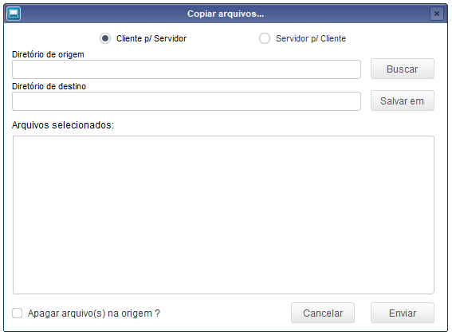
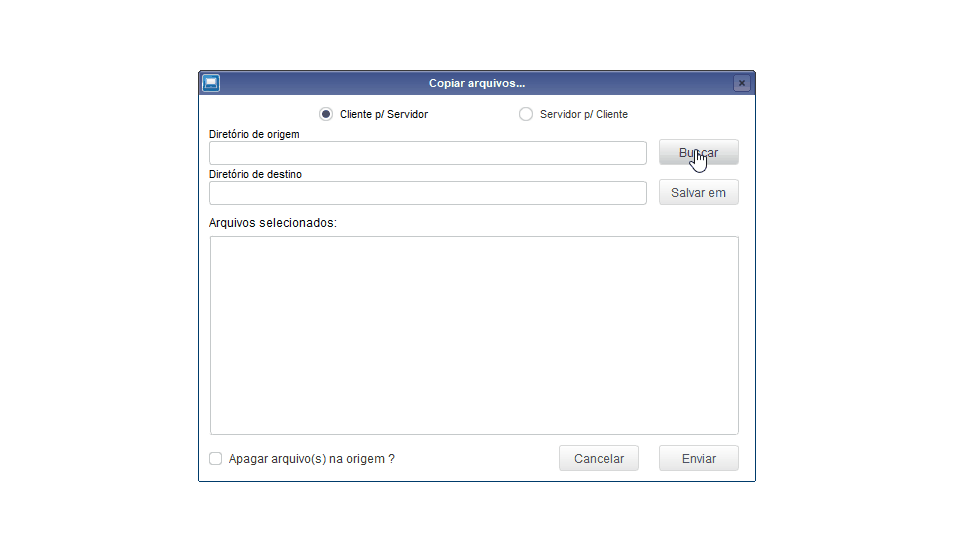
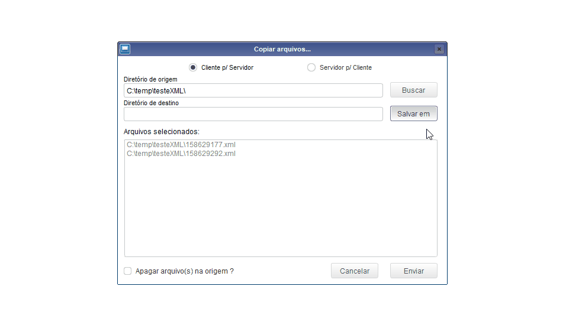
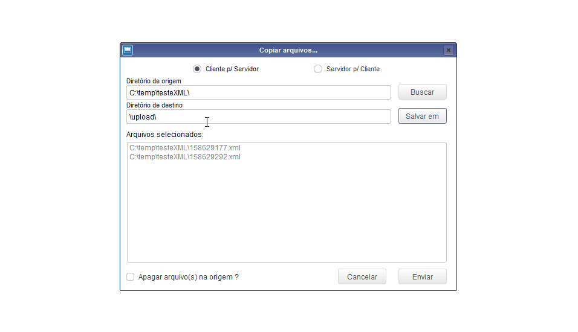
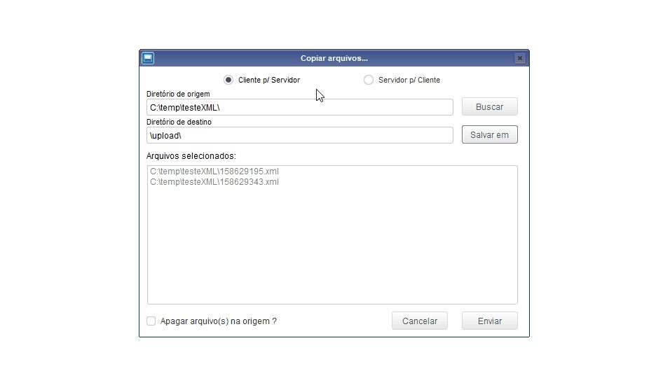

# tlpp-copy-and-send-files-server

Tranferir arquivos entre client e server (ROOTPATH). Desenvolvida na linguagem TL++ (Linguagem proprietária da TOTVS)

 

1. [Definição](#Definição)
1. [Exemplo de execução](#Exemplo-de-execução)
1. [Observações](#Observações)

 

## Definição

Rotina para realizar a transferencia de arquivos entre o cliente que está executando o 'smartclient' e o servidor, dentro da ROOTPATH.

 

## Exemplo de execução
Ao abrir o programa a seguinte tela será apresentada.
 

 

Para buscar o diretório de origem o programa abrirá uma janela para selecionar os arquivos.

 

Para buscar o diretório de destino dos arquivos clique no botão 'Salvar em'.

 

Após selecionar os diretórios e arquivos clique em 'Enviar' para realizar a transferencia.

 

## Observações
Ao mudar o fluxo de transferencia, mudando entre 'Cliente p/ Servidor' e 'Servidor p/ Cliente' os dados preenchidos serão apagados.

